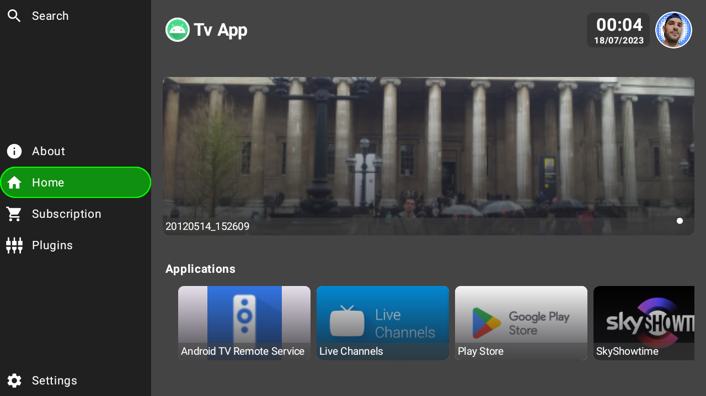
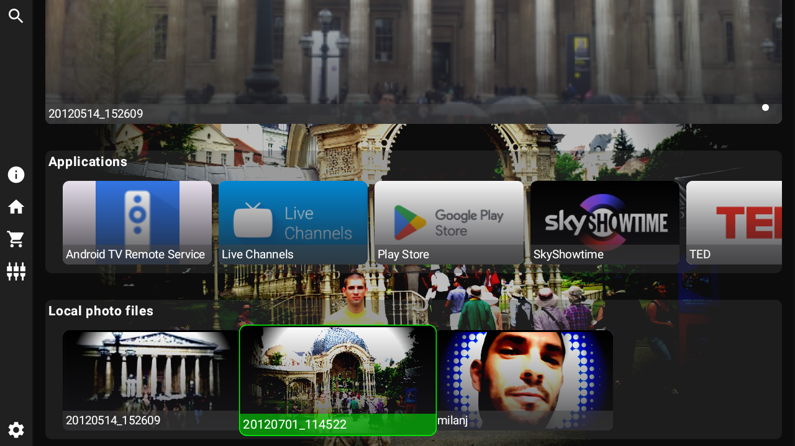
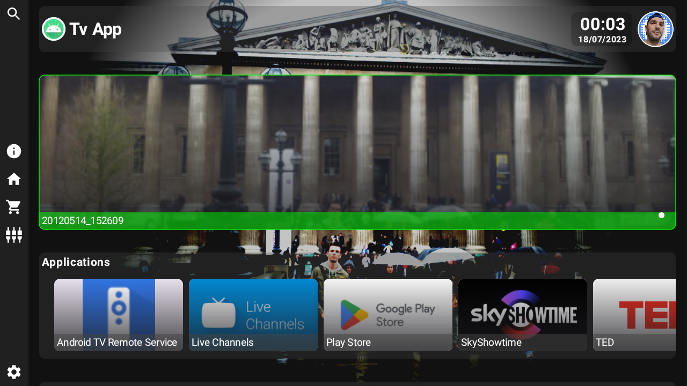

# Android TV test app

## Download

## Stats

## Table of Contents

- [Documentation](#project-documentation)
- [Screenshots](#screenshots)
- [Description](#description)
- [Compilation](#compilation)
- [Usage](#usage)
- [Credits](#credits)
- [License](#license)

## Project documentation

- [App code documentation](documentation/app/index.md)
- [Lib code documentation](documentation/lib/index.md)

## Screenshots

## Description

All in one, tablet, mobile and tv android app.

App is divided to two modules, tvlib which is main tv library for easier tv app developement 
and a demo app in app module.

Library and demo app is still under development.

Just an test app as showcase of coding skills, using modern frameworks  
and a new unstable tv compose framework for tv apps with the diferrence  
that components in this example should be touchable and therefore this  
example can be used on any device include tv, tablet or any mobile phone.

Components should be responsive to display size.

Technologies that will be used:

- Compose
- Dagger/Hilt
- ViewModels MVVM pattern
- Glide
- Kotlin
- LifeCycle
- Solve problems with compose previews
- Coroutines
- Flow
- Navigation
- Retrofit
- Json serialization (Moshi)
- Gradle scripting / configuration
- MarkDown editing
- Github actions
- Shell scripting
- Yaml scripting
- CI/CD
- SyncAdapter
- Automatic documentation
- Automatic release
- Toml dependencies
- Gradle plugins
- Screenshots auto creation (coming soon)
- AI test auto creation (coming soon)

## Compilation

Use Android studio or use command:

- debug app version :
  ./gradlew assembleDebug
- release app version :
  ./gradlew assembleRelease

## Usage

- Usable on any android device > SDK V 21 - Lollipop
- Use as you want. Freeware

## Credits

Milan Jurkulak

## License

No licenced.